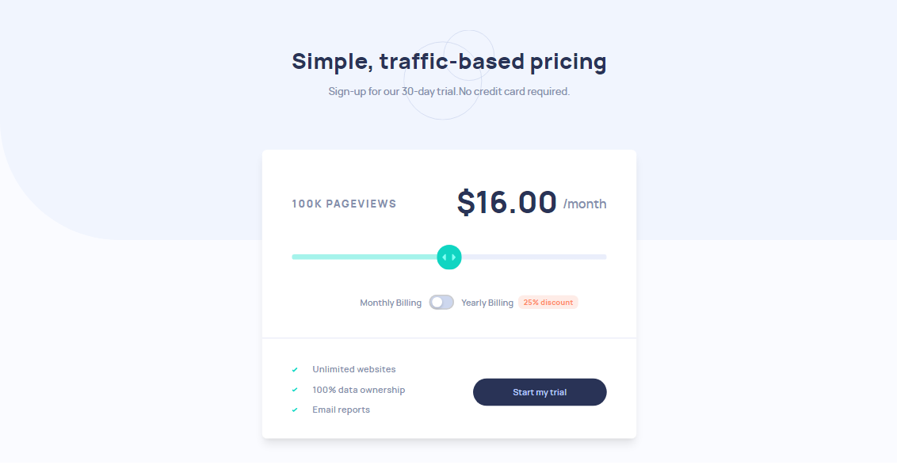
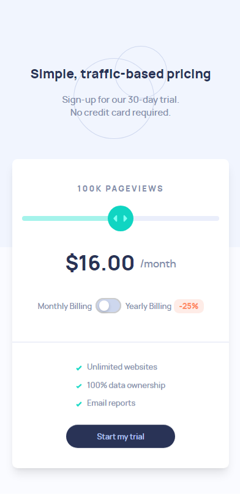

# Frontend Mentor - Interactive pricing component solution

This is a solution to the [Interactive pricing component challenge on Frontend Mentor](https://www.frontendmentor.io/challenges/interactive-pricing-component-t0m8PIyY8). Frontend Mentor challenges help you improve your coding skills by building realistic projects. 

## Table of contents

- [Overview](#overview)
  - [The challenge](#the-challenge)
  - [Screenshot](#screenshot)
  - [Links](#links)
- [My process](#my-process)
  - [Built with](#built-with)
  - [Useful resources](#useful-resources)
- [Author](#author)

## Overview

### The challenge

Users should be able to:

- View the optimal layout for the app depending on their device's screen size
- See hover states for all interactive elements on the page
- Use the slider and toggle to see prices for different page view numbers

### Screenshot

### Links

- Solution URL: [Github](https://github.com/JuanMiranda1998/interactive-pricing-frontend-mentor)
- Live Site URL: [Netlify](https://example.com)

## My process

### Built with

- Semantic HTML5 markup
- CSS custom properties
- Flexbox
- CSS Grid
- Mobile-first workflow
- [React](https://reactjs.org/) - JS library

### Useful resources

- [Slider](https://blog.logrocket.com/creating-custom-css-range-slider-javascript-upgrades/) - 
This article helped me to style the slider component.

## Author

- Frontend Mentor - [@JuanMiranda1998](https://www.frontendmentor.io/profile/JuanMiranda1998)
- Twitter - [@juan__miranda__](https://twitter.com/juan__miranda__)